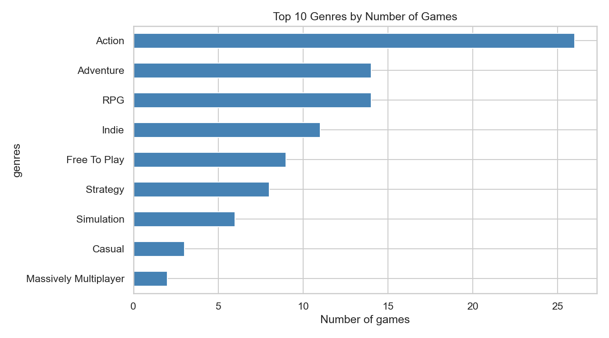
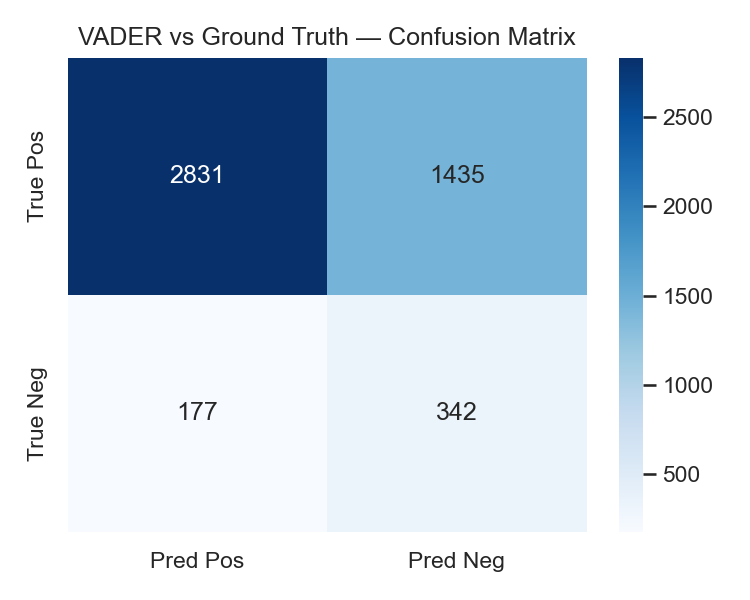

# steam-gaming-trends

Exploratory analysis of Steam game and review data, with VADER baseline sentiment classification. The processed dataset is exported as `outputs/processed_reviews.parquet` for downstream use in **Project 17 — steam-review-classifier**.

## What's Inside

Three staged notebooks:

| Notebook | Focus |
|---|---|
| `01_data_profiling.ipynb` | Schema inspection, null audit, distributions |
| `02_eda_trends.ipynb` | Genre popularity, pricing trends, release volume, feature engineering |
| `03_baseline_sentiment.ipynb` | VADER sentiment vs ground-truth labels; parquet export |

## Quick Start

```bash
pip install -r requirements.txt

# 1. Fetch data from Steam's free public API (no account needed)
python data/fetch_steam_public.py
#    ...or, if you have a Kaggle account, the larger dataset:
#    python data/download_data.py

# 2. Run notebooks in order
jupyter lab
```

The committed notebooks are already executed against real Steam data, so all
charts render directly on GitHub.

## Data Source

The default fetcher (`data/fetch_steam_public.py`) uses Steam's **public web API**
— no API key or Kaggle account required:

- `store.steampowered.com/api/appdetails` — price, genres, release date per game
- `store.steampowered.com/appreviews/<id>` — review text + the user's recommended flag

For a curated set of ~40 popular titles it produces:

- `games.csv` — game-level metadata + global review counts (`positive`, `negative`, `median_playtime_forever`, `genres`, `release_date`)
- `recommendations.csv` — ~4 800 individual English reviews (`review`, `is_recommended`)

A Kaggle path (`data/download_data.py`, dataset **fronkongames/steam-games-dataset**)
remains available for a much larger sample. Raw files are git-ignored.

## Selected Figures





## Feature Engineering

Three derived features (see `src/features.py`):

| Feature | Formula |
|---|---|
| `review_positivity_ratio` | `positive / (positive + negative)` |
| `price_per_playtime_hour` | `price / median_playtime_forever` (hours) |
| `release_year_lag` | `current_year - release_year` |

## Outputs

`outputs/processed_reviews.parquet` — schema:

| Column | Type | Description |
|---|---|---|
| `app_name` | string | Game title |
| `review_text` | string | Raw review body |
| `recommended` | bool | Ground-truth label |
| `vader_polarity` | string | `positive` / `negative` / `neutral` |
| `vader_compound` | float | VADER compound score (−1 to 1) |

## Project Structure

```
steam-gaming-trends/
├── data/
│   ├── download_data.py
│   └── README.md
├── docs/
│   └── feature_log.md
├── notebooks/
│   ├── 01_data_profiling.ipynb
│   ├── 02_eda_trends.ipynb
│   └── 03_baseline_sentiment.ipynb
├── outputs/
│   ├── figures/
│   └── processed_reviews.parquet   ← generated by notebook 03
├── src/
│   ├── features.py
│   └── sentiment.py
├── requirements.txt
└── pyproject.toml
```

## Licence

Code: MIT. Data: CC0 (Kaggle fronkongames/steam-games-dataset).
