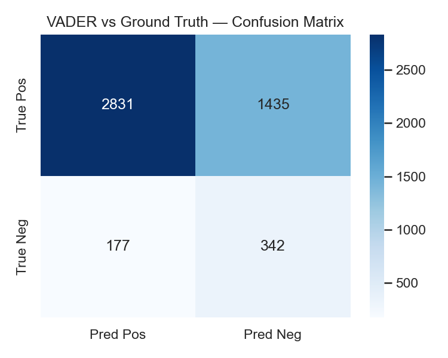

# steam-gaming-trends

Notebooks that explore Steam game metadata and reviews and score the reviews with VADER sentiment. Notebook 03 writes `outputs/processed_reviews.parquet`, the input for the steam-review-classifier project.

## Run

```bash
pip install -r requirements.txt
python data/fetch_steam_public.py   # about 40 games and 4,800 reviews from Steam's public API
jupyter lab                         # run notebooks/01, 02, 03 in order
```

The fetcher needs no API key. Steam rate-limits the review endpoint, so a second run within a few minutes may skip some games. The committed notebooks already contain their outputs.



## Outputs

`outputs/processed_reviews.parquet` has the columns `app_name`, `review_text`, `recommended` (the reviewer's own label), `vader_polarity` (positive, negative or neutral) and `vader_compound` (-1 to 1). Derived features such as `review_positivity_ratio` are defined in `src/features.py` and described in `docs/feature_log.md`.

Code is MIT licensed. Steam data is © Valve, fetched from the public store API.
